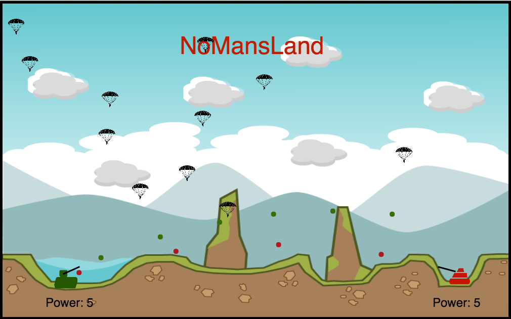

# NoMansLand [Live](http://www.timothycallahan.io/nomansland)

  NoMans Land is a browser game written in pure Javascript and animated using
HTML5/Canvas. It includes a computer AI for single player mode.



### How to Play

  Visit the live site [Here](http://www.timothycallahan.io/nomansland).
Each player controls a tank with the following keys:

* Player 1

`W` : tank barrel up
`S` : tank barrel down
`D` : fire missile
`Q` : increase power
`A` : decrease power

* Player 2

`↑` : tank barrel up
`↓` : tank barrel down
`←` : fire missile
`<` : increase power
`>` : decrease power

First player to score a hit on the opposing tank wins.

### Future Improvements

##### Destructible terrain
  I would like to explore the possibility of having destructible terrain.
This could be implemented by overlaying the current terrain image over a
second image with the terrain destroyed. By storing the state of the image on top,
I could remove sections of it when a missile collision occurs.

##### Better AI
  Currently the AI player makes a series of moves as dictated by a series
of `setTimeout` functions:
`````javascript
setInterval(function () {
  this.game.AIPlayer.move();
}.bind(this), 300);

setInterval(function () {
  this.game.AIPlayer.fire();
}.bind(this), 300);

setInterval(function () {
  this.game.AIPlayer.increasePower();
}.bind(this), 4500);
`````

This could be improved by adding more randomness to its movements.
